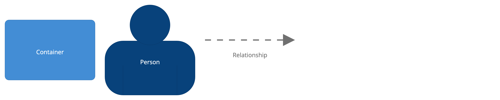

# PlannerX (ToDo App - My WebPlanner)

# Table of Contents

1. [Description](#description)
2. [Requirements](#requirements)
3. [Install & Run](#install--run)
4. [System design](#system-design)
5. [How to use](#how-to-use)

## Description

Small application for managing personal tasks and task lists.

## Requirements

* Docker [(install here)](https://docs.docker.com/get-docker/)

## Install & Run

This command will install and run this application:

```bash
docker-compose up
```

## System design

<details>
    <summary>More</summary>

### Global System context

Diagram of global system context


### Global System context (Web Application - Database)

Diagram of global system context


### Software system - Web Application

Diagram of Web Application - inner components


### Software system - Docker components

Docker components - for dev


### Diagram - Legend



###  

</details>

## How to use

Application will be accessible via docker on:

* [localhost:8085](http://localhost:8085)
* To access as existing user: (example)

```
  Admin
    email: master@master.com
    password: test
  User:
    email: jbracey1@slashdot.org
    password: test
  User:
    email: nkeaves2@webeden.co.uk
    password: test    
```

PhpMyAdmin will be accessible via docker on:

* [localhost:8099](http://localhost:8099)

